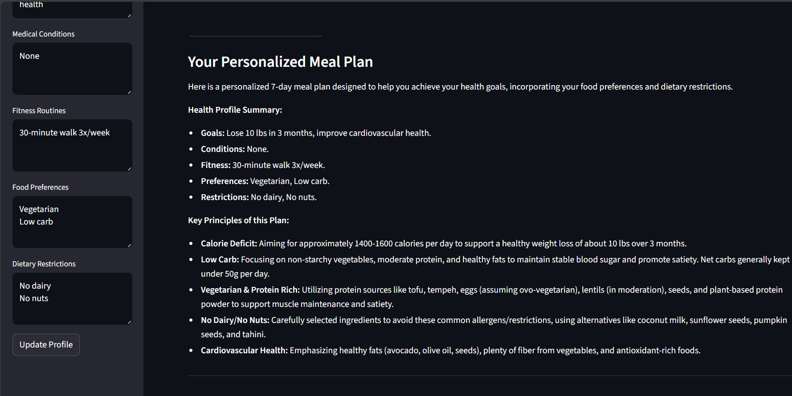
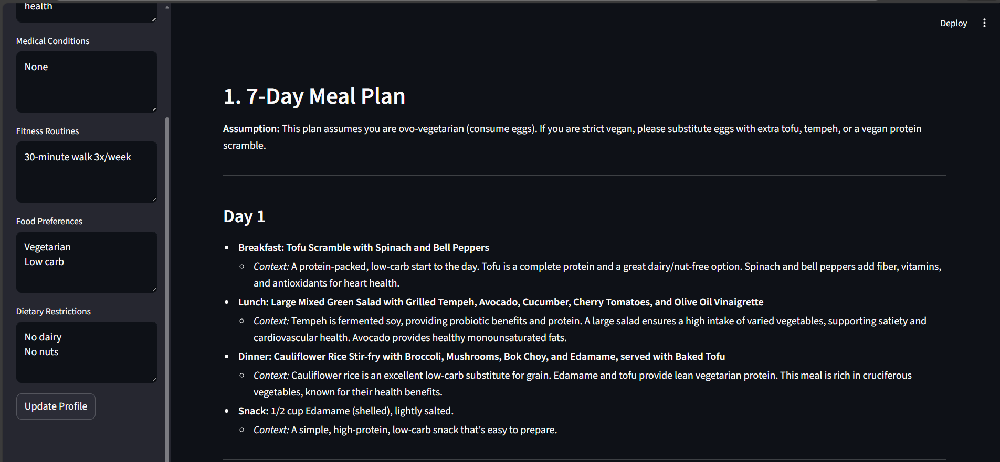
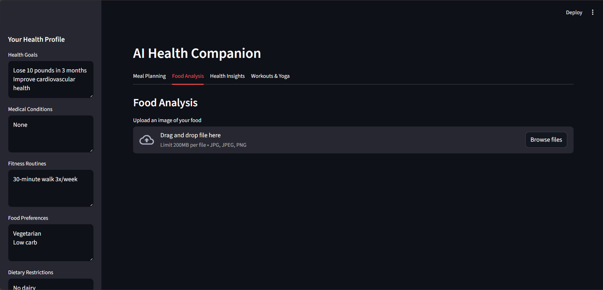
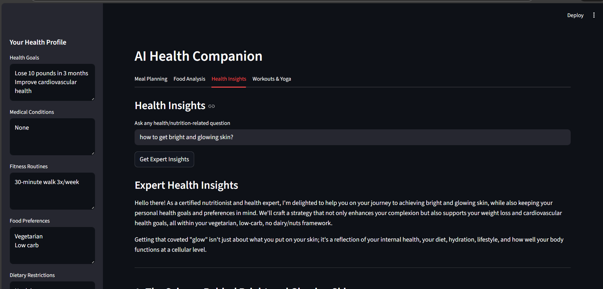
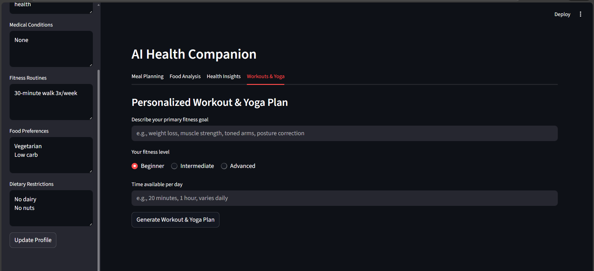

# 🥗 AI Health Companion


AI Health Companion is an intelligent wellness assistant built using **Streamlit** and **Google Gemini AI**.  
It helps users plan meals, analyze food nutrition from images, and generate personalized workout plans based on their goals and available time.

---

## 🚀 Features

- 🥗 Personalized Meal Planner  
- 📸 Food Nutrition Analysis from Image  
- 🧘 AI-Generated Workout Plans  
- 🎯 Goal-based Health Suggestions  
- ⏱️ Time-based Fitness Planning  
- 🤖 Powered by Google Gemini AI  

---

## 📸 App Screenshots

### 🏠 Home Page


### 🥗 Meal Planner



### 📸 Food Analysis


### 💡 Health Insights



### 🧘 Workout Plan


---

## 🛠️ Tech Stack

- Python  
- Streamlit  
- Google Generative AI (Gemini)  
- Pillow  
- python-dotenv  

---

## 📂 Project Structure

ai_health_companion/
│
├── app.py
├── requirements.txt
├── README.md
├── .env
├── screenshots/
│   ├── home.png
│   ├── meal_plan1.png
│   ├── meal_plan2.png
│   ├── food_analysis.png
│   ├── health_insights.png
│   └── workout.png
└── venv/


---

## ⚙️ Installation

### 1️⃣ Clone the repository

```bash
git clone https://github.com/swastiverse-182/ai_health_companion.git
cd ai_health_companion

2️⃣ Create virtual environment
python -m venv venv

3️⃣ Activate environment

Windows

venv\Scripts\activate


Mac/Linux

source venv/bin/activate

4️⃣ Install dependencies
pip install -r requirements.txt

🔑 Setup API Key

Create a .env file in project root:

GOOGLE_API_KEY=your_api_key_here


Get Gemini API key from Google AI Studio.

▶️ Run the App
streamlit run app.py


App will open at:

http://localhost:8501

🎯 Use Cases

Students tracking diet & fitness

Busy professionals planning meals

Beginners starting workouts

Health-conscious individuals

AI nutrition experimentation

🔮 Future Improvements

BMI & calorie tracking dashboard

Weekly meal calendar

Diet restrictions (vegan/keto)

Progress tracking

Mobile UI optimization


⭐ Acknowledgements

Google Gemini AI

Streamlit

Python community

📜 License

This project is for educational purposes.


---

